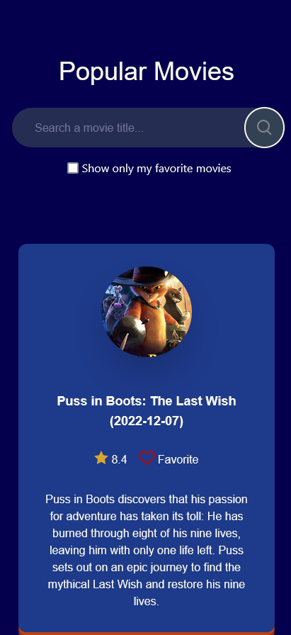
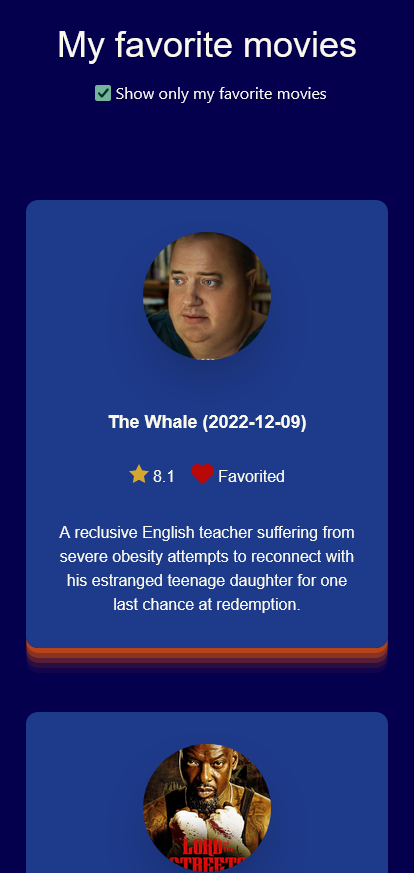
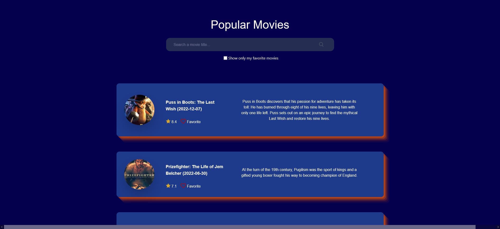
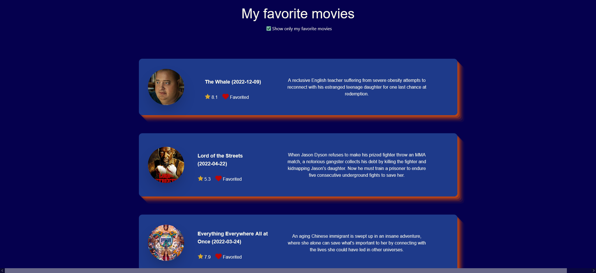

<h1 align="center">My Movie List</h1>

<div align="center">

&nbsp;
&nbsp;
&nbsp;
&nbsp;
</div>

## Table of contents

- [Overview](#overview)
  - [Description](#description)
  - [Screenshots](#screenshot)
  - [Links](#links)
  - [Project Setup](#project-setup)
- [My process](#my-process)
  - [Built with](#built-with)
  - [What I learned](#what-i-learned)
  - [Continued development](#continued-development)
  - [Useful resources](#useful-resources)
- [Author](#author)
- [Acknowledgments](#acknowledgments)

## Overview

### Description

Users should be able to:

- See a list of the top 20 most popular movies of The Movie DataBase API
- Add movies to a list of favorite movies, the list must be persisted in the localstorage
- Alternate between main page and list of favorite movies by toggling the checkbox below the search bar
- Search any movie title in the main page
- See a responsive layout according to screen size

### Screenshots

<div align="center">
    
    
    
    
</div>

### Links

- Solution URL: [GitHub](https://github.com/natalia-sampaio/my-movie-list)
- Live Site URL: [Vercel]()

### Project Setup

```sh
npm install
```

#### Compile and Hot-Reload for Development

```sh
npm run dev
```

#### Compile and Minify for Production

```sh
npm run build
```

## My process

### Built with

- Semantic HTML5 markup
- Responsive layout
- [TailwindCSS](https://tailwindcss.com/) - CSS framework
- [Vue.js](https://vuejs.org/) - JS framework

### What I learned

This project was my second time using Vue.js and my first time using Tailwind CSS.

I enjoyed very much the use of Tailwind CSS, especially how intuitive and self explanatory it is, this is a tool that I will definitely keep using and improving on.

I was able to use Vue's routers to alternate between the main and favorite movies page: 

```js
const router = createRouter({
  history: createWebHistory(import.meta.env.BASE_URL),
  routes: [
    {
      path: '/',
      name: 'home',
      component: HomeView
    },
    {
      path: '/favorites',
      name: 'favorites',
      // route level code-splitting
      // this generates a separate chunk (About.[hash].js) for this route
      // which is lazy-loaded when the route is visited.
      component: () => import('../views/FavoritesView.vue')
    }
  ]
})
```

Rendering the movie cards was the best part, it helped me understand much more about how to manipulate data and use the different types of components. It was in this part that I learnd about Lifecycle and Lifecycle Hooks.

```js
<script setup>
import HeartIcon from './icons/IconHeart.vue'
import StarIcon from './icons/IconStar.vue'
import HeartLabel from './HeartLabel.vue';
</script>

<script>
import { useLocalStorage } from '@vueuse/core'
export default {
    props: {
        movie: Object
    },
    data() {
        return {
            favoriteMovies: useLocalStorage("movies", []),
            checked: false
        };
    },
    methods: {
        saveMovieAsFavorite() {
            if (!this.checked) {
                this.removeMovieFromFavorites();
                return;
            }
            console.log(this.movie)
            this.favoriteMovies.push(this.movie);
        },
        removeMovieFromFavorites() {
            this.favoriteMovies.splice(this.favoriteMovies.findIndex(element => element.id === this.movie.id), 1);
        },
        getFavoritedMovies() {
            if (this.favoriteMovies.find(element => element.id === this.movie.id)) {
                this.checked = true;
            }
        }
    },
    beforeMount() {
        this.getFavoritedMovies();
    }
}
</script>
```
```js
<template>
    <div class="...">
        <div class="m-8">
            
        </div>
        <div class="...">
            <span class="...">{{ movie.title }} ({{ movie.release_date }})</span>
            <div class="...">
                <StarIcon />
                <span class="pl-1">{{ movie.vote_average }}</span>
                <label class="flex pl-4">
                    <input type="checkbox" class="hidden" v-model="checked" @change="saveMovieAsFavorite" aria-label="like button">
                    <HeartIcon :svgColor="checked ? '#BA0707' : 'none'" class="hover:fill-red-700"/>
                    <HeartLabel :label="checked ? 'Favorited' : 'Favorite'" />
                </label>
            </div>
        </div>
        <span class="...">{{ movie.overview }}</span>
    </div>
</template>
``` 


### Continued development

In future projects I want to improve the usage of Vue.js, especially about best practices with this framework.

I also want to keep using and improving on Tailwind CSS.

### Useful resources

- [7 Days of Code](https://7daysofcode.io/matricula/javascript-e-dom-api/) - This project idea came from the 7 Days of Code challenge, by Alura. I you speak portuguese check it out.
- [Vue.js Doc](https://vuejs.org/guide/introduction.html) - The Vue.js documentation is very easy to read and it helped me a lot with my first steps.
- [Vue School](https://vueschool.io/) - Learn the basics with practice.
- [Vue Use](https://vueuse.org/) - Collection of Essential Vue Composition Utilities, here is the package that allowed me to use the useLocalStorage function, very useful.
- [Tailwind CSS Doc](https://tailwindcss.com/) - The Tailwind documentation is very easy to read and it helped me a lot.
- [CSS Scan](https://getcssscan.com/css-box-shadow-examples) - Here I got the css for some nice shadow box that made my page very pretty.

## Author

<a href="natalia.srsa@proton.me"></a>

<a href="https://www.linkedin.com/in/natalia-srs/"></a>

<a href="https://twitter.com/NataliaSRSA"></a>

## Acknowledgments

My husband [@filipedanielski](https://twitter.com/filipedanielski) who is always supporting and encouraging me.


